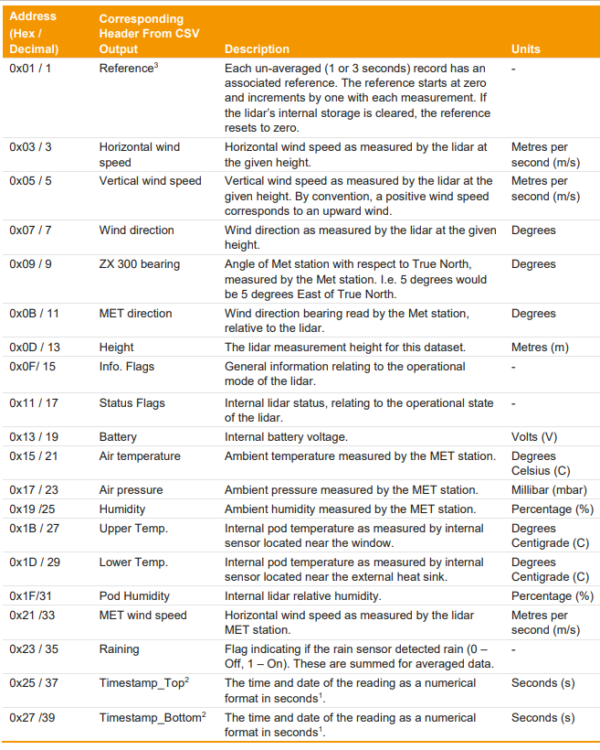
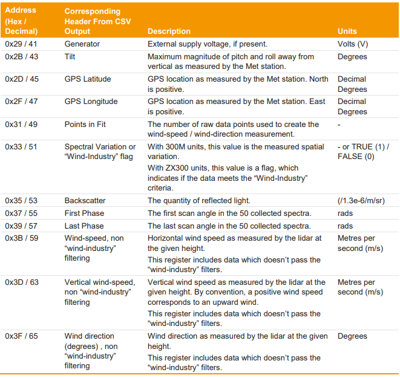

# Lidar_Data
**Using this code it is possible to extract data using Modbus TCP/IP from the Lidar unit. This data gets interpreted and may be used for different purposes such as the digital twin (IoT application).
The register numbers are based on the Modbus Guide by the manufacturer ZXLidar. 
It is important to be aware that the implemented Modbus function is read only. Any changes to the Lidar unit must be made using the Waltz Software.**

## Data Structure

**After receiving the data (using lidar_data.py) the dataset is published internally on Motion Sensor Box using ZeroMQ. The dataset needs to contain specific parameters to be compatible with other services running on the Motion Sensor Box e.g. the fusionlog and the lidar_mqtt.py script.**

**lidar_mqtt.py is used to publish the lidar data to a server using the MQTT protocol.**

## Glossary

**timestamp_data_received** = this time stamp is genearted by the motion sensor box when a new data set is received

**uptime** = the system uptime (of motion sensor box)

**reference_of_dataset** = each data set has its own reference number,
					   the reference number may be used to check whether any data	
					   might be lost
					   
**timestamp_data_generated** = this timestamp is generated by the lidar unit and corresponds
						   to the reference number
						 
**set_height_x** = the height of a wind speed measurement that is configured in the Waltz Software (symbol x = {1, 2, ... n})

**individual_reference_x** = reference number of a wind speed measurement height dataset. Since the lidar unit is only able to measure each height at every full
						 iteration once, the individual_reference_x corresponds only to this 
						 sub data set. This reference is used for the calculation of the individual_timestamp_x
						 
**individual_timestamp_x** = time stapm of a wind speed measurement height dataset. The individual_timestamp_x is not received from the lidar station. It is calculated as followed: The time it takes to measure one height (usually 1 second) is multiplied by the place in the order of heights (measured from highest to lowest) and then added to the timestamp received by the lidar unit.
						 
**horizontal_windspeed_x** = the horizontal wind speed at the given height measured in m/s

**vertical_windspeed_x** = the vertical wind speed at the given height. A positive value corresponds to -gravity direction (upwards), a negative value corresponds to +gravity direction (downwards).

**wind_direction_x** = the wind direction at the given height. 0° = wind is coming from North and blowing towards South, 90° = wind is coming from East.

**temperature** = the air temperature measured by the met station 

**battery** = the voltage of the battery

**air pressure** = the air pressure measured by the met station

**windspeed(*met-station*)** = the windspeed measured by the met station (approx. 1.5 m above the ground)

**tilt** = tilt measured by the met station (if there is nonzero tilt the lidar measures in a line that has an angular offeset to the g acceleration vector)

**humidity** = air humidity

**wind_direction** = wind direction measured at approx. 1.5 m above the ground

**pod_upper_temperature** = internal pod temperature as measured by the internal 
						sensor located near the window
						
**pod_lower_temperature** = internal pod temperature as measured by the internal 
						sensor located near the external heat sink
						
**pod_humidity** = internal pod relative humidity

**scan_dwell_time** = the time it takes to measure all wind speeds and parameters at one height

## Error Codes
**If the Lidar can not measure a specific value, the Modbus register contains error codes instead. Explanation
is as followed:**

**9999** = it is not possible to measure wind speed data. Possible causes may include
	   very low wind speed, partial obstruction on the scanner window or interference
	   with the laser beam.
		
**9998** = atmospheric conditions which affect the wind speed measurement. This may be 
	   fog or precipitation.

**Since the data is streamed to a remote server which can only display the data properly if 
any extraordinary values are hidden, the value 9999 and 9998 are replaced with the value None**

## Modbus Registers

**The Modbus registers may be found in the ModbusGuide by the manufacturer ZXLidar. Not all registers displayed 
in the ModbusGuide are polled in the script "lidar_data.py". Some other registers were found by reverse engineering
these include the register numbers of the vertical wind speeds and the wind direction for each height.
These register numbers may be looked up in the "lidar_data.py" script.**

